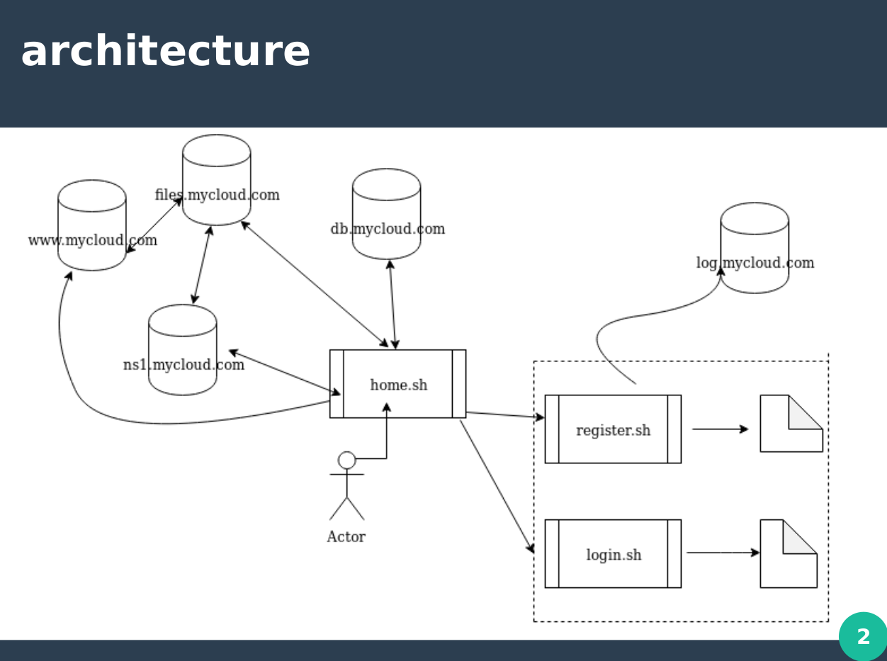

# MyCloud
A cloud backup service designed and implemented during internship at one.com. (bash version)
 

## Overview:

This is an infrastructure based project with some elements involving software development implemented in bash. There is another version with front end designed in HTML,CSS, javascript and backend in Php. This is watered down version of what the actual project at one.com looks like where customers can manage their web pages through a file manager interface. 

Key elements of the project are as follows:  

The user interacts with client side application (home.sh).The resolved request lands on webcache server running nginx as reverse proxy for load management which proxies the request to apache web server. The user can register or login from the home page.The web server relays authentication request to database server running Mariadb. Once logged in, smartview page (smartview.sh) personalised for customer opens up where customer can see available backups of their files (NFS mounted on web server). The actual backups are stored separately on files application server. The user can view ,checkout (similar to git checkout) and rollback backups with option to manually sync local space to cloud storage. The client side application contains a timer controlled systemd service which sync specified directories on local machine to cloud. The timer is triggered upon installation/running the application.There is separate SMTP server running postfix for customer notifications. Client side diagnostics and server level logging are shipped (rsyslog/fluentd) to logging server. Timer based Nagios checks sends server status to central monitoring server, running shinken for monitoring interface. Real time metrics are pulled for grafana hosted on monitoring server.The lookups are done via naming server running bind DNS. The project was done via Gitlab CI/CD pipeline and chef for automated deployment. 

For more details see [project description](./mycloud.pdf)

